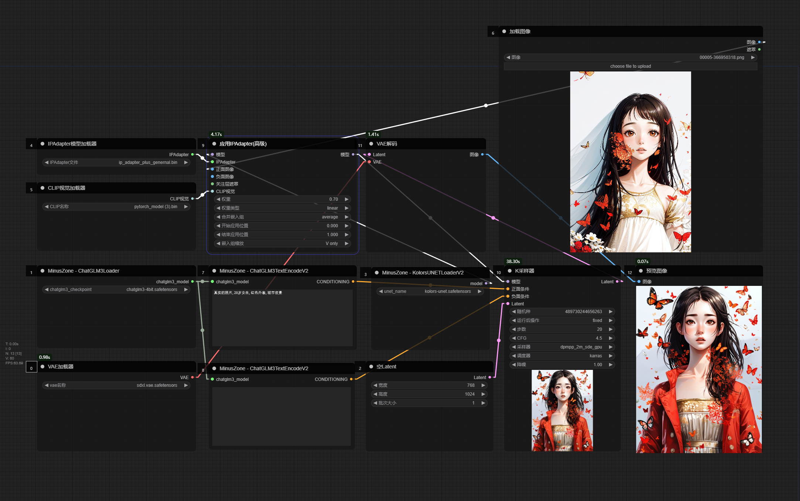
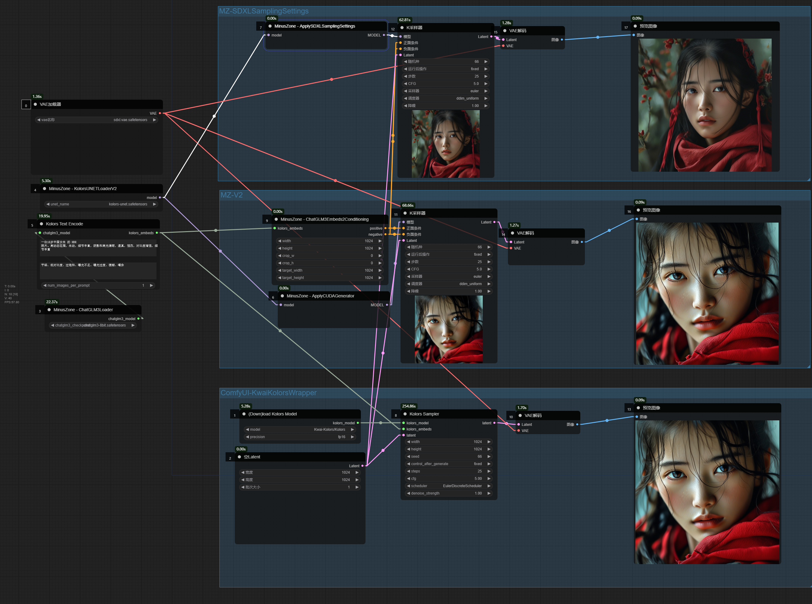

## Recent changes 
* [2024-08-02] 支持faceid,新增一些相关节点,工作流见examples/workflow_ipa_faceid.png
* [2024-07-27] 新增MZ_KolorsControlNetLoader节点,用于加载可图ControlNet官方模型
* [2024-07-26] 新增MZ_ApplySDXLSamplingSettings节点,用于V2版本重新回到SDXL的scheduler配置.
  

* [2024-07-25] 修正sampling_settings,参数来自 [scheduler_config.json](https://huggingface.co/Kwai-Kolors/Kolors/blob/main/scheduler/scheduler_config.json),仅V2生效
* [2024-07-21] 感谢来自yiwangsimple对Mac修复和测试的分支  https://github.com/yiwangsimple/ComfyUI-Kolors-MZ
* [2024-07-21] 新增MZ_ChatGLM3TextEncodeAdvanceV2节点
* [2024-07-18] IPA相关节点已在ComfyUI_IPAdapter_plus中支持
* [2024-07-17] 新增支持IPAdapter_plus的加载器和高级应用节点 MZ_KolorsCLIPVisionLoader,MZ_IPAdapterModelLoaderKolors,MZ_IPAdapterAdvancedKolors
* [2024-07-14] 删除自动兼容ControlNet, 新增MZ_KolorsControlNetPatch节点
  

## ComfyUI上Kolors的实现

参考自 https://github.com/kijai/ComfyUI-KwaiKolorsWrapper

使用ComfyUI原生采样

工作流在examples/workflow.png中获取
 
### UNET模型下载
unet模型放置在 models/unet/ 文件夹下

模型主页: https://huggingface.co/Kwai-Kolors/Kolors

下载地址: https://huggingface.co/Kwai-Kolors/Kolors/resolve/main/unet/diffusion_pytorch_model.fp16.safetensors
 

### ChatGLM3模型下载
chatglm3放置在 models/LLM/ 文件夹下

模型主页: https://huggingface.co/Kijai/ChatGLM3-safetensors

下载地址: https://huggingface.co/Kijai/ChatGLM3-safetensors/resolve/main/chatglm3-fp16.safetensors

## IPAdapter实现推荐使用 [cubiq/ComfyUI_IPAdapter_plus](https://github.com/cubiq/ComfyUI_IPAdapter_plus)
faceid相关节点已经在其中支持,IPAdapter实现需要更新ComfyUI_IPAdapter_plus到最新版本
### IPAdapter工作流
https://github.com/cubiq/ComfyUI_IPAdapter_plus/blob/main/examples/ipadapter_kolors.json

### IPAdapter_FaceIDv2工作流
https://github.com/cubiq/ComfyUI_IPAdapter_plus/blob/main/examples/IPAdapter_FaceIDv2_Kolors.json

### 官方IP-Adapter-Plus模型下载地址
模型主页: https://huggingface.co/Kwai-Kolors/Kolors-IP-Adapter-Plus

https://huggingface.co/Kwai-Kolors/Kolors-IP-Adapter-Plus/resolve/main/ip_adapter_plus_general.bin 下载至 models/ipadapter/

https://huggingface.co/Kwai-Kolors/Kolors-IP-Adapter-Plus/resolve/main/image_encoder/pytorch_model.bin 下载至 models/clip_vision/

### 官方Kolors-IP-Adapter-FaceID-Plus模型下载地址
模型主页: https://huggingface.co/Kwai-Kolors/Kolors-IP-Adapter-FaceID-Plus

https://huggingface.co/Kwai-Kolors/Kolors-IP-Adapter-FaceID-Plus/resolve/main/ipa-faceid-plus.bin 下载至 models/ipadapter/

https://huggingface.co/Kwai-Kolors/Kolors-IP-Adapter-FaceID-Plus/resolve/main/clip-vit-large-patch14-336/pytorch_model.bin 下载至 models/clip_vision/

https://huggingface.co/MonsterMMORPG/tools/resolve/main/antelopev2.zip 下载并解压至 models/insightface/models/antelopev2/*.onnx

### 官方ControlNet模型下载地址
模型主页(Depth): https://huggingface.co/Kwai-Kolors/Kolors-ControlNet-Depth

模型主页(Canny): https://huggingface.co/Kwai-Kolors/Kolors-ControlNet-Canny

模型主页(Pose): https://huggingface.co/Kwai-Kolors/Kolors-ControlNet-Pose

### Kolors-Inpainting模型下载地址
模型主页: https://huggingface.co/Kwai-Kolors/Kolors-Inpainting

https://huggingface.co/Kwai-Kolors/Kolors-Inpainting/resolve/main/unet/diffusion_pytorch_model.safetensors 下载至 models/unet/

## Implementation of Kolors on ComfyUI

Reference from https://github.com/kijai/ComfyUI-KwaiKolorsWrapper

Using ComfyUI Native Sampling

The workflow is obtained in examples/workflow.png

### UNET model download
The unet model is placed in the models/unet/ folder

Model homepage: https://huggingface.co/Kwai-Kolors/Kolors

Download link:
https://huggingface.co/Kwai-Kolors/Kolors/resolve/main/unet/diffusion_pytorch_model.fp16.safetensors

### ChatGLM3 model download
The chatglm3 is placed in the models/LLM/ folder

Model homepage: https://huggingface.co/Kijai/ChatGLM3-safetensors

Download link:
https://huggingface.co/Kijai/ChatGLM3-safetensors/resolve/main/chatglm3-fp16.safetensors

## IPAdapter implementation is recommended to use [cubiq/ComfyUI_IPAdapter_plus](https://github.com/cubiq/ComfyUI_IPAdapter_plus)
The faceid related nodes have been supported in it, and the IPAdapter implementation needs to update ComfyUI_IPAdapter_plus to the latest version
### IPAdapter workflow
https://github.com/cubiq/ComfyUI_IPAdapter_plus/blob/main/examples/ipadapter_kolors.json

### IPAdapter_FaceIDv2 workflow
https://github.com/cubiq/ComfyUI_IPAdapter_plus/blob/main/examples/IPAdapter_FaceIDv2_Kolors.json

### Official IP-Adapter-Plus model download link

Model homepage: https://huggingface.co/Kwai-Kolors/Kolors-IP-Adapter-Plus

https://huggingface.co/Kwai-Kolors/Kolors-IP-Adapter-Plus/resolve/main/ip_adapter_plus_general.bin Download to models/ipadapter/

https://huggingface.co/Kwai-Kolors/Kolors-IP-Adapter-Plus/resolve/main/image_encoder/pytorch_model.bin Download to models/clip_vision/

### Official Kolors-IP-Adapter-FaceID-Plus model download link
Model homepage: https://huggingface.co/Kwai-Kolors/Kolors-IP-Adapter-FaceID-Plus

https://huggingface.co/Kwai-Kolors/Kolors-IP-Adapter-FaceID-Plus/resolve/main/ipa-faceid-plus.bin Download to models/ipadapter/

https://huggingface.co/Kwai-Kolors/Kolors-IP-Adapter-FaceID-Plus/resolve/main/clip-vit-large-patch14-336/pytorch_model.bin Download to models/clip_vision/

https://huggingface.co/MonsterMMORPG/tools/resolve/main/antelopev2.zip Download and unzip to models/insightface/models/antelopev2/*.onnx

### Official ControlNet model download link
Model homepage(Depth): https://huggingface.co/Kwai-Kolors/Kolors-ControlNet-Depth

Model homepage(Canny): https://huggingface.co/Kwai-Kolors/Kolors-ControlNet-Canny

Model homepage(Pose): https://huggingface.co/Kwai-Kolors/Kolors-ControlNet-Pose

### Kolors-Inpainting model download link
Model homepage: https://huggingface.co/Kwai-Kolors/Kolors-Inpainting

https://huggingface.co/Kwai-Kolors/Kolors-Inpainting/resolve/main/unet/diffusion_pytorch_model.safetensors Download to models/unet/

## 使用ComfyUI-KwaiKolorsWrapper在相同种子下测试结果 (Testing results with the same seed using ComfyUI-KwaiKolorsWrapper)
测试工作流来自examples/workflow_same_seed_test.png 

The test workflow comes from examples/workflow_same_seed_test.png

## FAQ
加载模型时出现的错误
+ 目前kolors有两个版本, 一种是unet类型采用unet加载器, 一种是放checkpoints文件夹用KolorsCheckpointLoaderSimple加载器, 如果你的模型来自huggingface的unet文件夹, 优先尝试使用unet加载器 (Currently, there are two versions of kolors, one is unet type using unet loader, and the other is placed in the checkpoints folder using KolorsCheckpointLoaderSimple loader. If your model comes from the huggingface unet folder, try to use the unet loader first)
+ 如果你无法确定模型类型, 那就都试一下 (If you are not sure about the model type, try both)

Mac用户无法使用(Mac users cannot use)
+ Mac用户可移步至[ComfyUI-Kolors-MZ](https://github.com/yiwangsimple/ComfyUI-Kolors-MZ)  (Mac users can go to [ComfyUI-Kolors-MZ](https://github.com/yiwangsimple/ComfyUI-Kolors-MZ) )

和IPAdapter有关的错误(Errors related to IPAdapter)
+ 确保ComfyUI本体和ComfyUI_IPAdapter_plus已经更新到最新版本(Make sure ComfyUI ontology and ComfyUI_IPAdapter_plus are updated to the latest version)

name 'round_up' is not defined
+ 参考:https://github.com/THUDM/ChatGLM2-6B/issues/272#issuecomment-1632164243 , 使用 pip install cpm_kernels 或者 pip install -U cpm_kernels 更新 cpm_kernels

module 'comfy.model_detection' has no attribute 'unet_prefix_from_state_dict'
+ 更新ComfyUI本体到最新版本(Update ComfyUI ontology to the latest version)

RuntimeError: Only Tensors of floating point dtype can require gradients
+ 尝试使用fp16版本的模型: https://huggingface.co/Kijai/ChatGLM3-safetensors/blob/main/chatglm3-fp16.safetensors

Error occurred when executing MZ_ChatGLM3Loader: 'ChatGLMModel' object has no attribute 'transformer'
+ 检查ChatGLM3Loader节点选择的模型是否已经正确下载

## Credits

- [Kolors](https://github.com/Kwai-Kolors/Kolors)
- [ComfyUI](https://github.com/comfyanonymous/ComfyUI) 
- [ComfyUI_IPAdapter_plus](https://github.com/cubiq/ComfyUI_IPAdapter_plus)

## Star History

<a href="https://star-history.com/#MinusZoneAI/ComfyUI-Kolors-MZ&Date">
 <picture>
   <source media="(prefers-color-scheme: dark)" srcset="https://api.star-history.com/svg?repos=MinusZoneAI/ComfyUI-Kolors-MZ&type=Date&theme=dark" />
   <source media="(prefers-color-scheme: light)" srcset="https://api.star-history.com/svg?repos=MinusZoneAI/ComfyUI-Kolors-MZ&type=Date" />
   
 </picture>
</a>

## Contact
- 微信Wechat: minrszone
- Bilibili: [minus_zone](https://space.bilibili.com/5950992)
- 小红书: [MinusZoneAI](https://www.xiaohongshu.com/user/profile/5f072e990000000001005472)

## Stargazers

## Sponsorship

